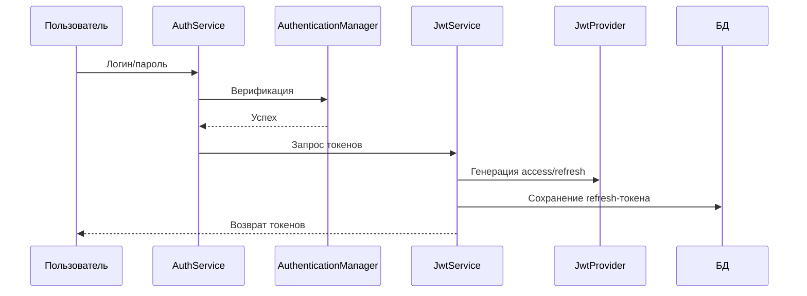
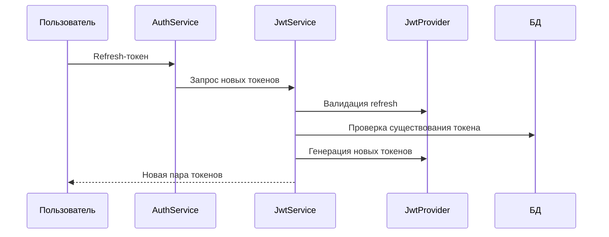
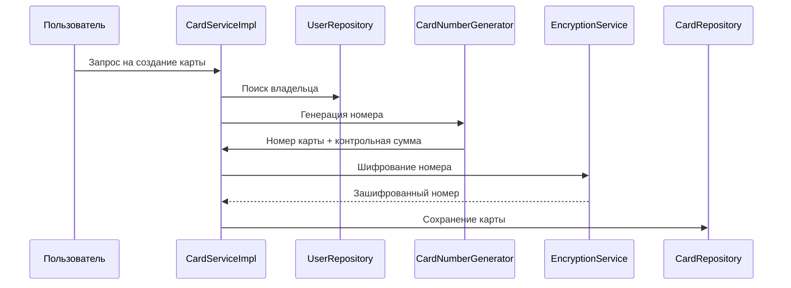
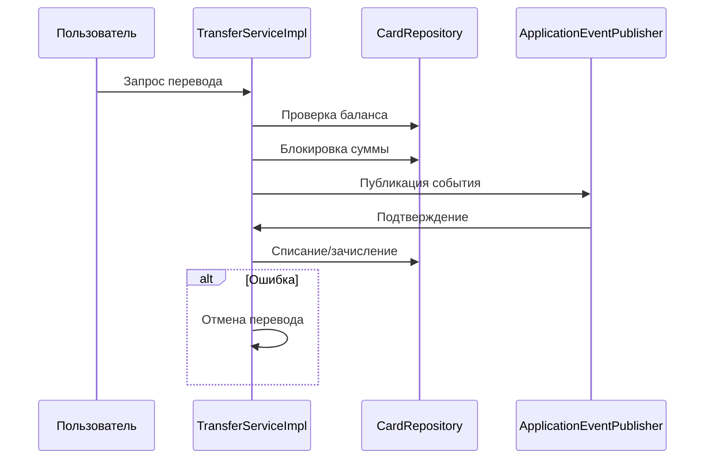
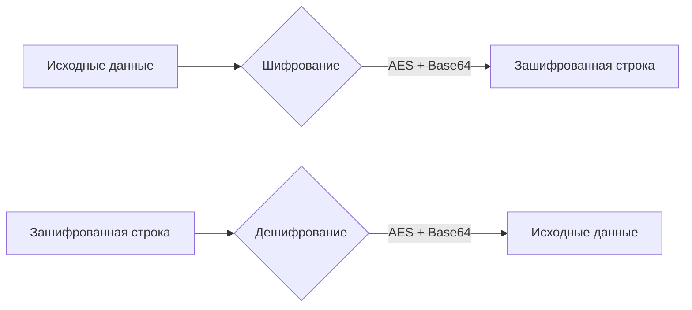
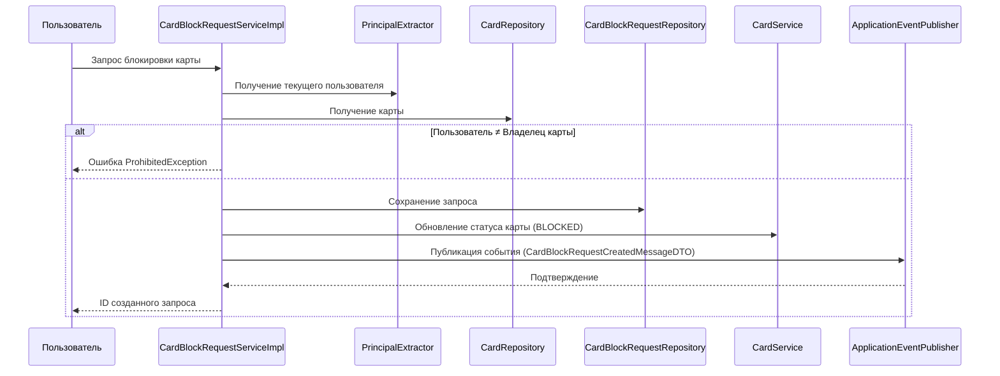
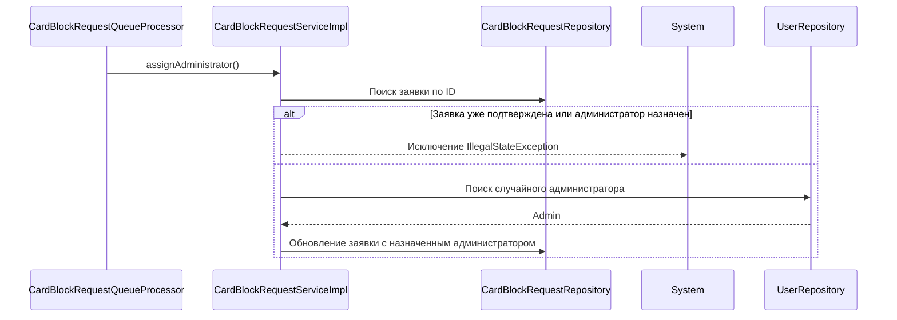
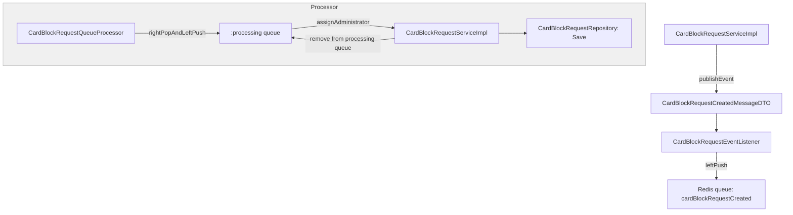

# Сервисы
### Сервисы для аутентификации и авторизации
**Реализация JWT-based безопасности для банковских карт**
### Сервисы для управления объяектами предметной области
**Реализация методов управления для банковских карт и трансферов между ними**
---

#### Основные функции
1. **Аутентификация пользователей** по логину/паролю
2. **Генерация JWT-токенов**:
    - Access-токен (короткоживущий)
    - Refresh-токен (долгоживущий)
3. **Обновление токенов** через refresh-токен
4. **Валидация токенов** на каждом запросе
5. **Денежные переводы между картами с двухэтапной верификацией** 
6. **Шифрование конфиденциальных данных (номера карт)** 
7. **Обработка запросов блокировки карты пользователя** 

---

#### Ключевые компоненты
| Компонент                          | Назначение                                           |
|------------------------------------|------------------------------------------------------|
| **`AuthService`**                  | Интерфейс для входа и обновления токенов             |
| **`CardService`**                  | Интерфейс управления сущностью Card                  |
| **`EncryptionService`**            | Интерфейс управления шифрованием                     |
| **`JwtService`**                   | Интерфейс генерации/регенерации JWT-токенов          |
| **`TransferService`**              | Интерфейс управления сущностью Transfer              |
| **`CardBlockRequestService`**      | Интерфейс управления сущностью CardBlockRequest      |
| **`AuthServiceImpl`**              | Реализация аутентификации через Spring Security      |
| **`CardServiceImpl`**              | Реализация управления сущностью Card                 |
| **`EncryptionServiceImpl`**        | Реализация управления шифрованием                    |
| **`JwtServiceImpl`**               | Логика работы с токенами и их сохранения в БД        |
| **`JwtProvider`**                  | Ядро для создания/проверки токенов (использует jjwt) |
| **`TransferServiceImpl`**          | Реализация управления сущностью Transfer             |
| **`UserDetailsServiceImpl`**       | Загрузка пользовательских данных для Spring Security |
| **`CardBlockRequestServiceImpl`**  | Реализация управления сущностью CardBlockRequest     |

---

#### Принцип работы
**1. Процесс входа:**


**2. Обновление токенов:**


**3. Управление жизненным циклом банковских карт (создание, блокировка, пополнение, удаление) с соблюдением финансовых правил и безопасности:**


**4. Денежный перевод с соблюдением финансовых правил и безопасности:**


**5. Шифрование данных (номер карты):**


**6. Запрос блокировки карты:**



**7. Назначение администратора на заявку блокировки (в данном случае просто реализация для упрощения):**


**8. 8. Взаимодействие Redis очередей (на примере заявки на блокировку карты):**


---

#### Особенности безопасности
- Раздельные секретные ключи для access/refresh токенов
- Хранение refresh-токенов в базе данных
- Валидация подписи токенов с помощью HMAC-SHA
- Автоматическая проверка срока действия
- Защита от невалидных/просроченных токенов
- Генерация номеров карт с проверкой по алгоритму Луна
- AES-шифрование номеров карт в базе данных
- Двухэтапная обработка переводов:
- Предварительная блокировка средств
- Финальное подтверждение/отмена
- Автоматический возврат средств при:
   <ul>
    <li>Просроченных транзакциях</li>
    <li>Блокировке карты получателя</li>
  </ul>
- Резервные счета для временного хранения средств при блокировках
- Возможность пользователя запросить блокировку карты

---

#### Настройки (application.properties)
```properties
# Время жизни токенов (минуты)
spring.application.security.jwt.access-key.expiration-time=30
spring.application.security.jwt.refresh-key.expiration-time=1440

# Секретные ключи (Base64)
spring.application.security.jwt.access-key.secret=ваш_секрет
spring.application.security.jwt.refresh-key.secret=ваш_секрет

# Секретные ключи (AES)
spring.application.security.crypto.type=type
spring.application.security.crypto.key=key

```

---

#### Зависимости
- **Spring Security** - аутентификация
- **jjwt** - работа с JWT
- **Hibernate Validator** - валидация данных
- **Lombok** - упрощение кода

Модуль обеспечивает безопасный доступ к API с соблюдением современных стандартов безопасности, используя двухуровневую токенную систему, 
позволяет управлять доменными сущностми в соответствии с бизнес-логикой приложения.