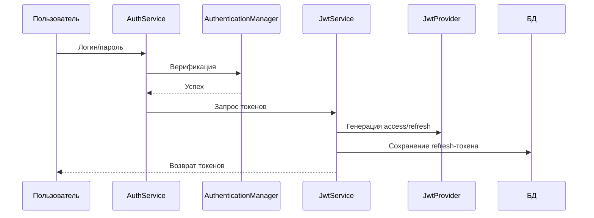
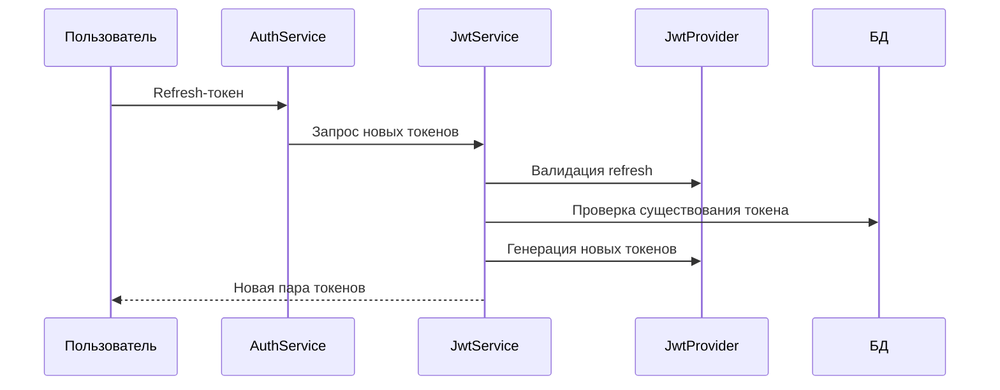

# Сервисы
### Сервисы для аутентификации и авторизации
**Реализация JWT-based безопасности для банковских карт**

---

#### Основные функции
1. **Аутентификация пользователей** по логину/паролю
2. **Генерация JWT-токенов**:
    - Access-токен (короткоживущий)
    - Refresh-токен (долгоживущий)
3. **Обновление токенов** через refresh-токен
4. **Валидация токенов** на каждом запросе

---

#### Ключевые компоненты
| Компонент               | Назначение                                                                 |
|-------------------------|----------------------------------------------------------------------------|
| **`AuthService`**       | Интерфейс для входа и обновления токенов                                   |
| **`JwtService`**        | Интерфейс генерации/регенерации JWT-токенов                               |
| **`AuthServiceImpl`**   | Реализация аутентификации через Spring Security                            |
| **`JwtServiceImpl`**   | Логика работы с токенами и их сохранения в БД                              |
| **`JwtProvider`**       | Ядро для создания/проверки токенов (использует jjwt)                      |
| **`UserDetailsServiceImpl`**| Загрузка пользовательских данных для Spring Security                  |

---

#### Принцип работы
**1. Процесс входа:**


**2. Обновление токенов:**


---

#### Особенности безопасности
- Раздельные секретные ключи для access/refresh токенов
- Хранение refresh-токенов в базе данных
- Валидация подписи токенов с помощью HMAC-SHA
- Автоматическая проверка срока действия
- Защита от невалидных/просроченных токенов

---

#### Настройки (application.properties)
```properties
# Время жизни токенов (минуты)
spring.application.security.jwt.access-key.expiration-time=30
spring.application.security.jwt.refresh-key.expiration-time=1440

# Секретные ключи (Base64)
spring.application.security.jwt.access-key.secret=ваш_секрет
spring.application.security.jwt.refresh-key.secret=ваш_секрет
```

---

#### Зависимости
- **Spring Security** - аутентификация
- **jjwt** - работа с JWT
- **Hibernate Validator** - валидация данных
- **Lombok** - упрощение кода

Модуль обеспечивает безопасный доступ к API с соблюдением современных стандартов безопасности, используя двухуровневую токенную систему.